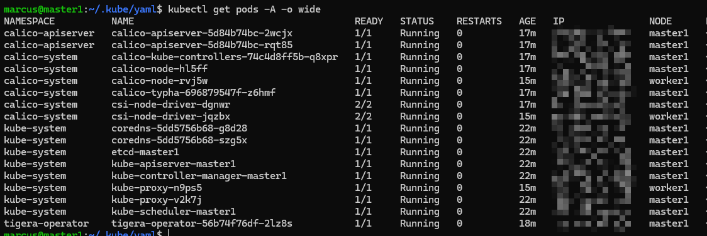

# K8s tutorials

## Install k8s cluster with cri-dockerd

### every node

before install steps, check these items
>os kernel is Ubuntu22.04 \
>every node ip is fixed \
>at least two nodes,one for master, another for worker \
>please make sure that master node id.ras.pub is in every node authorized_keys

1. Install Docker-ce & cri-dockerd
    * Execute ./bin/InstallDocker.sh
    * sudo nano /usr/lib/systemd/system/cri-docker.service \
        `ExecStart=/usr/bin/cri-dockerd --container-runtime-endpoint fd:// --network-plugin=cni --cni-bin-dir=/opt/cni/bin --cni-cache-dir=/var/lib/cni/cache --cni-conf-dir=/etc/cni/net.d`
    * Execute `sudo systemctl daemon-reload;sudo systemctl restart cri-docker.service`
    * check `docker info` and `sudo systemctl status cri-docker.service`
2. Execute ./bin/Setup.sh
    * setting resource,iptable,and swap
3. ExecInstall ./bin/InstallK8sComponenets.sh
    * Install k8s components in every node

### master node

    ```bash
    # need to specify cri-socket
    sudo kubeadm config images pull --cri-socket unix:///var/run/cri-dockerd.sock
    # check your ip 
    sudo kubeadm init \
        --apiserver-advertise-address={your-master-ip} \
        --pod-network-cidr=10.244.0.0/16 \
        --service-cidr=10.96.0.0/12  \
        --token-ttl=0 \
        --cri-socket unix:///run/cri-dockerd.sock \
        --upload-certs
    mkdir -p $HOME/.kube
    sudo cp -i /etc/kubernetes/admin.conf $HOME/.kube/config
    sudo chown $(id -u):$(id -g) $HOME/.kube/config
    kubectl create -f https://raw.githubusercontent.com/projectcalico/calico/v3.29.0/manifests/tigera-operator.yaml
    wget https://raw.githubusercontent.com/projectcalico/calico/v3.29.0/manifests/custom-resources.yaml
    nano custom-resources.yaml #revise your pod-network-cidr
    kubectl apply -f custom-resources.yaml
    sudo kubeadm token create --print-join-command # for worker node
    ```
suggestion => export KUBECONFIG="$HOME/.kube/config"

### worker node

submit kubeadm token create command \
**remeber to add --cri-socket unix:///var/run/cri-dockerd.sock**

`kubectl get pods -A -o wide`


## YAML engineer
